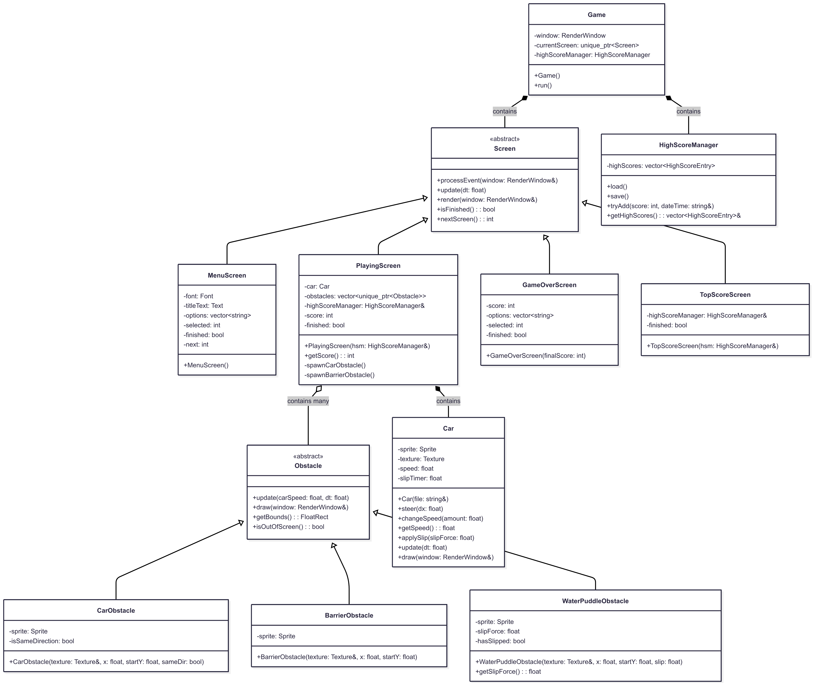
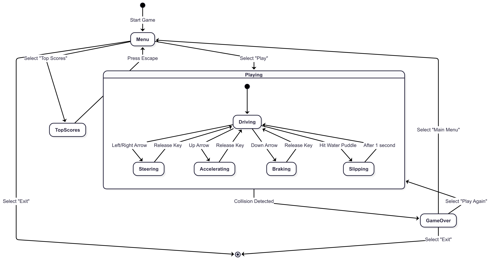
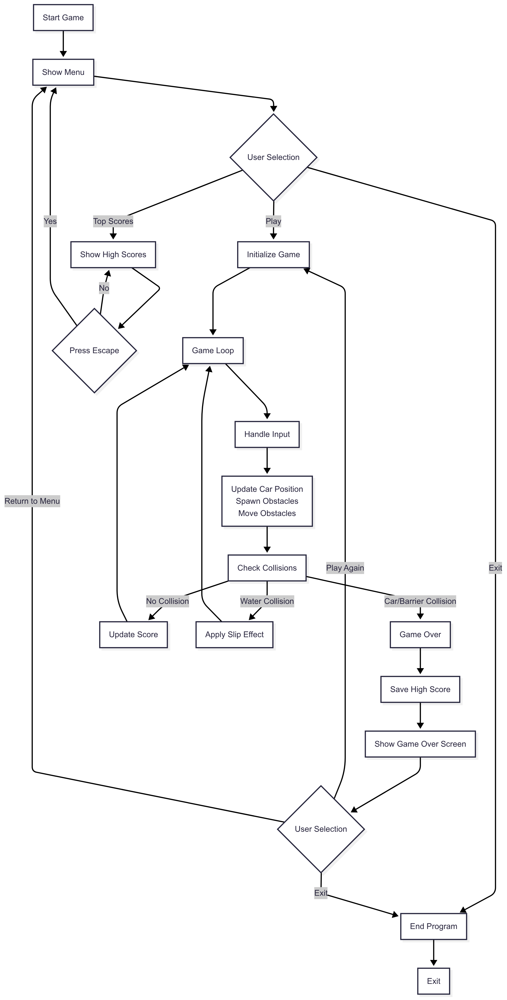

# 🏎️ Racing Game

A 2D racing game built with C++ and SFML featuring obstacle avoidance, dynamic physics, and high score tracking.

## 🎮 Game Description & Features

### Core Gameplay
- **Dynamic Car Control**: Smooth steering with realistic physics including slip effects
- **Multi-lane Highway**: Navigate through 6 lanes with scrolling background
- **Three Obstacle Types**:
  - **Enemy Cars**: Same direction (slower) and opposite direction (faster)
  - **Static Barriers**: Fixed roadblocks in center lane
  - **Water Puddles**: Cause temporary loss of control (1-second slip effect)
- **Progressive Difficulty**: Obstacle spawn rate increases with car speed
- **Lane-based Scoring**: Left lanes (+10 points), Right lanes (+20 points)

### Game Features
- **High Score System**: Top 10 scores saved with timestamps
- **Multiple Screens**: Menu, Playing, Game Over, Top Scores
- **Audio System**: Background music, engine sounds, and sound effects
- **Speed Control**: Car speed range from 100-1500 units
- **Collision Detection**: Precise bounding box collision system

## 🕹️ Gameplay Instructions & Controls

### Controls
| Key | Action |
|-----|--------|
| `↑` | Accelerate |
| `↓` | Brake/Decelerate |
| `←` | Steer Left |
| `→` | Steer Right |
| `Enter` | Select Menu Option |
| `↑/↓` | Navigate Menu |
| `Esc` | Return to Menu (from Top Scores) |

### How to Play
1. **Main Menu**: Select "Play", "Top Scores", or "Exit"
2. **Racing**: 
   - Avoid enemy cars and barriers (instant game over)
   - Navigate through water puddles carefully (causes slip)
   - Score points by passing obstacles
   - Survive as long as possible for high score
3. **Game Over**: View score and choose to play again or return to menu
4. **Top Scores**: View leaderboard with best 10 scores

### Scoring System
- **Left lanes**: +10 points per obstacle spawn cycle
- **Right lanes**: +20 points per obstacle spawn cycle
- **Speed bonus**: Higher speeds = more frequent scoring opportunities

## 💻 Technical Architecture & Code Structure
### File structure
```
racingGame/
├── main.cpp                    # Entry point
├── Game.h/.cpp                 # Main controller
├── View/                       
│   ├── Screen.h                # Interface abstract
│   ├── MenuScreen.h/.cpp       # Menu
│   ├── PlayingScreen.h/.cpp    # Game loop
│   ├── GameOverScreen.h/.cpp   # Game Over
│   └── TopScoreScreen.h/.cpp   # High scores
├── Model/                      # Main entities 
│   ├── Car.h/.cpp              
│   └── Obstacle.h/.cpp         
└── Utils/                      # Utilities
    └── HighScoreManager.h/.cpp 
```
### Class diagram

### State diagram

### Activity diagram


## 📸 Screenshots

### Main Menu
)
*Navigate between Play, Top Scores, and Exit options*

### Gameplay
)
*Avoid obstacles while scoring points on the highway*

### Game Over Screen
)
*View final score and choose next action*

### Top Scores
)
*View top 10 scores with timestamps*

## 📦 Dependencies & Requirements

### Required Libraries
- **SFML 2.4.2 or higher**
  - `sfml-graphics` - Rendering system
  - `sfml-window` - Window management  
  - `sfml-audio` - Sound and music
  - `sfml-system` - Core utilities

### System Requirements
- **OS**: Windows (Visual Studio project)
- **Compiler**: C++11 compatible (Visual Studio 2012+)
- **Resolution**: 980x800 (fixed)
- **Input**: Keyboard only

### Development Environment
- **IDE**: Visual Studio Express 2012 or higher
  - Visual Studio Community (free alternative)
  - Visual Studio Professional/Enterprise
- **Project Type**: Visual C++ Console Application
- **Configuration**: Debug/Release x86
---

**Ready to race! 🏁**
